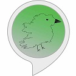

## eBirdus / Birdie Sightings
Retrieve notable bird sightings from ebird.org APIs for the island of Ireland

- Allow users to say a county _Kerry_ and return only the sightings in Kerry.  
- Allow users to say a day _Monday_ sightings and return the sightings for that specific day.  
- Allow users to say a day _Monday_ and a location _Kerry_ sightings and return only the sightings in Kerry that specific day.  


# Birdie Sightings Alexa app


Depending on where your Alexa device is registered to.  
Mine is registered to Amazon.com but with UK English language.  
[Amazon.com Birdie Sightings app](https://www.amazon.com/dp/B08LVX99MT)  
[Amazon.co.uk Birdie Sightings app](https://www.amazon.co.uk/dp/B08LVX99MT)

 
## How to Build and Deploy
From parent directory. Build the jar via maven.  
`mvn clean install`  
Update existing the Lambda with the new jar.  
`aws lambda update-function-code --function-name ebirdus --zip fileb://./target/ebirdus-1.0-SNAPSHOT.jar`  
Invoke the Lambda remotely.  
`aws lambda invoke --function-name ebirdus --log-type Tail outfile`  
The LogResult is returned in Base64 so will need to be decoded.


## Ebird.org API

Excellent bird learning resource provided by Cornell University USA.  

Notable birds
```
curl "https://api.ebird.org/v2/data/obs/IE/recent/notable?back=1" -H "X-eBirdApiToken: d4adr470eh9u"  
```
[Ebird.org postman docs](https://documenter.getpostman.com/view/664302/S1ENwy59?version=latest#intro)  
Postman collection in test resources.


### Lessons Learnt

- Adding a more specific request phrase, "open birdie sightings for {Dublin}" does not trigger the correct intent, so I added "for county {Dublin}" or "for {Dublin} city"
- Check which language is the app targeting UK or US english. Top left of the code section in Alexa console.
- App can be cloned into same language but different region, description of the apps can be different between regions.
- Implementing the required Intents & the SessionEndHandler which is not documented well as a requirement until the Amazon certification failed the app.  
- When app returns <Audio message> sound but no logs when calling via the simulator or real device, try redeploying the lambda, renaming the invocation name.
- Innovation name has to be 2 words to be published but can be one word for development.
- SL4J logging was a mess. Needed an 'Uber Jar' and other versions of L4J in AWS Lambda classpath.


### Improvements

- If the requested day is not available fall back to most recent result. How to along iterating back in days? 
- eBird.org provide a RESTful API


### Testing

I'm happy to blur the lines between unit and integration tests as this is a small project.  
- Unit tests   
- Integration tests - calling Ebird API.  

*End to End test* this is where I would like to assert against the Alexa output see alexaResponse.json.  
The problem with E2E tests :
- Where are they run from, locally, CI or in AWS. - Running locally with the credential file. 
- How to authenticate to call the lambda. Using local aws token in file loaded via Default strategy.
- How to call Lambda directly or do I need APIGateway in front. - did not need ApiGateway can call directly.
